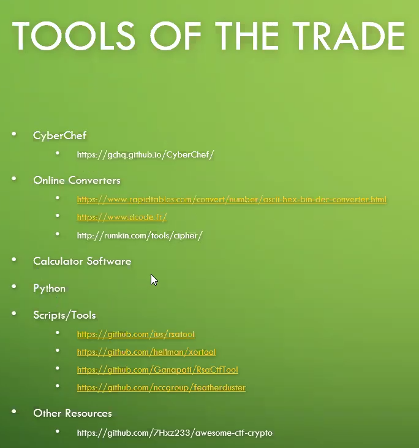

# Cryptography

## Reference

**[https://charcharbinks.com/post/ctf_crypto_for_beginners/](https://charcharbinks.com/post/ctf_crypto_for_beginners/)**

**[http://practicalcryptography.com/ciphers/](http://practicalcryptography.com/ciphers/)**

**[https://cryptopals.com/](https://cryptopals.com/)**

**[https://github.com/pcw109550/write-up](https://github.com/pcw109550/write-up)**

**[https://github.com/ashutosh1206/Crypto-CTF-Writeups](https://github.com/ashutosh1206/Crypto-CTF-Writeups)**

**[https://github.com/sobolevn/awesome-cryptography](https://github.com/sobolevn/awesome-cryptography)**

**[https://www.youtube.com/watch?v=dWfUxWCwX9k](https://www.youtube.com/watch?v=dWfUxWCwX9k) (Solving CTF Challenges: Cryptography)**

**[https://www.youtube.com/watch?v=ASfAPOiq_eQ](https://www.youtube.com/watch?v=ASfAPOiq_eQ) (The Enigma Machine Explained)**

**[https://www.geeksforgeeks.org/cryptography-introduction/](https://www.geeksforgeeks.org/cryptography-introduction/)**

**[https://www.dcode.fr](https://www.dcode.fr/)**

**[https://gchq.github.io/CyberChef/](https://gchq.github.io/CyberChef/)**

**[https://cryptii.com/](https://cryptii.com/)**



## Paratice

[https://www.tutorialspoint.com/cryptography_with_python/cryptography_with_python_understanding_rsa_algorithm.htm](https://www.tutorialspoint.com/cryptography_with_python/cryptography_with_python_understanding_rsa_algorithm.htm)

## Enconding


## ASCII Table

[https://www.asciitable.com/](https://www.asciitable.com/)


## Esoteric Language

`+>>>+++++++++++++++++++++++++[≥+++++++++++++++++++]`

- BrainFuck Language
    
    ### Decorder
    
    - [https://www.dcode.fr/brainfuck-language](https://www.dcode.fr/brainfuck-language)
    - Tool to decode/encode in Brainfuck, an esoteric programming language consisting of characters like ++++---[+++].

## Bit Strings

`\xe7\xde7\-\^\xbev`

## ROT Cipher Decorder

[ROT Cipher - Rotation - Online Rot Decoder, Solver, Translator](https://www.dcode.fr/rot-cipher)

## Morse Decorder

```jsx
.--. .. -.-. --- -.-. - ..-. { -- ----- .-. ... ...-- -.-. ----- -.. ...-- .---- ... ..-. ..- -. ...-- ----. ----- ..--- ----- .---- ----. ..... .---- ----. }
```

- [https://morsecode.world/international/decoder/audio-decoder-adaptive.html](https://morsecode.world/international/decoder/audio-decoder-adaptive.html)
- https://github.com/fastrgv/MATTA
- [https://databorder.com/transfer/morse-sound-receiver/](https://databorder.com/transfer/morse-sound-receiver/)

## RSA CTF Tools

[https://github.com/RsaCtfTool/RsaCtfTool.git](https://github.com/RsaCtfTool/RsaCtfTool.git)

- [https://www.dcode.fr/rsa-cipher](https://www.dcode.fr/rsa-cipher)
- https://github.com/zweisamkeit/RSHack - RSA Encryption တွေမှာ `Arguments ([-h] -n modulus -e public_exponent -c ciphertext):` တွေပဲ ပေးထားမယ်ဆိုရင် ဒီ Tools ကို သုံးလို့ရပါတယ်။ `rshack.py`
- write up picoctf : [https://github.com/HHousen/PicoCTF-2021/blob/master/No Padding%2C No Problem/README.md](https://github.com/HHousen/PicoCTF-2021/blob/master/No%20Padding%2C%20No%20Problem/README.md)


## CSRT Decorder

- [https://www.sslshopper.com/csr-decoder.html](https://www.sslshopper.com/csr-decoder.html)
- `openssl req -in mycsr.csr -noout -text`

## Rail Fence Cipher

[https://www.dcode.fr/rail-fence-cipher](https://www.dcode.fr/rail-fence-cipher)

## Substitute

substitute လုပ်တယ်ဆိုတာ strings တွေကို အစားထိုးတာဖြစ်ပါတယ်။ အဲ့ဒါကိုတော့ CyberChef မှာလုပ်နိုင်ပါတယ်။

picoctf challenge - [https://play.picoctf.org/practice/challenge/307?category=2&originalEvent=70&page=1](https://play.picoctf.org/practice/challenge/307?category=2&originalEvent=70&page=1)


- Substitue လုပ်မယ်ဆိုရင် `[subbreaker](https://gitlab.com/guballa/SubstitutionBreaker)` ကိုသုံးပြီးတော့ လုပ်လို့ရပါတယ်။

## Encoding/Decoding Format

- **Base 16** (hexadecimal) encoding uses the hexadecimal number system (0123456789ABCDEF) to encode text. The base16 encoding of
 `thura lin htut is the best`
**Encode Base 16** - `7468757261206C696E2068747574206973207468652062657374`
- **Base 32** is very similar to base16 encoding but it has a larger alphabet, and uses padding characters (equals signs). The base32 encoding of `Thura lin htut is the best`
**Encode base 32** - `KRUHK4TBEBWGS3RANB2HK5BANFZSA5DIMUQGEZLTOQ======`
- **Base 64** is similar to base32, but it has an even larger alphabet! It also uses padding characters. The base64 encoding of `Thura lin htut is the best`
**Encode base 64 -** `VGh1cmEgbGluIGh0dXQgaXMgdGhlIGJlc3Q=`
- **URL Encoding** is defined in [IETF RFC 3986](https://tools.ietf.org/html/rfc3986#section-2.1). Essentially, URL encoding is a standard used to encode specific data or characters in URLs.  [https://meyerweb.com/eric/tools/dencoder/](https://meyerweb.com/eric/tools/dencoder/)
Encoded URL - [`thuralinhtut.com](http://thuralinhtut.com/)%2Fempire%20team`
- ********************Binary -********************
    
    ********************`01110100 01101000 01110101 01110010 01100001 00100000 01101100 01101001 01101110 00100000 01101000 01110100 01110101 01110100 00100000 01100110 01101111 01110101 01101110 01100100 01100101 01100100 00100000 01110100 01101000 01100101 00100000 01100101 01101101 01110000 01101001 01110010 01100101`**
    
- **********************Octal - `145 155 160 151 162 145 40 151 163 40 147 162 145 141 164 40 141 164 40 141 154 154 40 164 151 155 145`**
- **********************Decimal - `101 109 112 105 114 101 32 105 115 32 103 114 101 97 116 32 97 116 32 97 108 108 32 116 105 109 101`**
- **********HexDecimal - `65 6d 70 69 72 65 20 69 73 20 67 72 65 61 74 20 61 74 20 61 6c 6c 20 74 69 6d 65`**

## Types of Ciphers

- Symmetric (single key)
    - Substitution
    - Transposition
- Asymmetric (dual key)

## Subsitution

- ********************Morse - 
Plaintext : `empire is great at all time`**
    
    **************************MorseCode :************************** 
    `. -- .--. .. .-. ... ...--. .-. . .- -.- -.- .-.. .-.... -- .`
    
- ******Letter Numbers******

### Caesarian Shift

The Caesarian Shift cipher, or Caesar cipher is a substitution method that involves rotating an alphabet by key `n` and substituting the rotated letters for the plaintext letters. The best visualization of how this works is a [Caesar Cipher Wheel](http://www.perkley.com/cipher-wheel/).

******Tools :****** [http://rumkin.com/tools/cipher/caesar.php](http://rumkin.com/tools/cipher/caesar.php)
************

If n=11 then our alphabets are:

ABCDEFGHIJKLMNOPQRSTUVWXYZ

LMNOPQRSTUVWXYZABCDEFGHIJK

So A=L, B=M, etc

```
Sample text for a Caesar Cipher.

```

would become

```
Dlxawp epie qzc l Nlpdlc Ntaspc.
```

### ROT 13

ROT13 is just a Caesar cipher with a key of 13. (or n = 13)

### Baconian

The Baconian cipher hides a message within a message.
[https://rumkin.com/tools/cipher/baconian/](https://rumkin.com/tools/cipher/baconian/)

## Vigener Cipher

- Vigener cipher ကိုတော့ ASCII Tables တစ်ခုပေးထားပြီးတော့ Decrpyt လုပ်ခိုင်းပါတယ်။ Decrypt လုပ်ဖို့အတွက်ဆိုရင် Key သိရင်ပိုအဆင်ပြေပါတယ်။
- Decorder - [https://www.dcode.fr/vigenere-cipher](https://www.dcode.fr/vigenere-cipher)
- the good one -[https://cryptii.com/pipes/vigenere-cipher](https://cryptii.com/pipes/vigenere-cipher)


## PlayFair Cipher

- Playfair Cipher ဆိုတာ playfair table ရဲ့ key ပေးထားပြီးတော့ plain text ကို decrypt , encrypt လုပ်ချင်းဖြစ်ပါတယ်။ - [https://www.geeksforgeeks.org/playfair-cipher-with-examplesn n n zx /](https://www.geeksforgeeks.org/playfair-cipher-with-examples/)

## Visual Cryptography

Visual cryptography is a cryptographic technique which allows visual information (pictures, text, etc.) to be encrypted in such a way that decryption can be done just by sight reading.

- [https://www.geeksforgeeks.org/visual-cryptography-introduction/](https://www.geeksforgeeks.org/visual-cryptography-introduction/)
- stegsolve
- stegonline
- 

## Navy Signal Code

Tool to decrypt/encrypt with the international maritime/navy signal flags/code automatically to communicate with ships.
- [https://www.dcode.fr/maritime-signals-code](https://www.dcode.fr/maritime-signals-code)


[https://www.notion.so](https://www.notion.so)