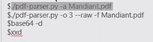

# Forensics CTF

- `strings` - search for all plain texts in file
    
    ## Command Tools
    
    - `strings filename`
- `grep` - search for particular string
- `bgrep` - search for non-text pattern.
- `hexdump`/ `xxd` - hex values of the file.
- `base64` base64 strings က နေ data အဖြစ်ပြောင်းလဲခြင်း။
    - `base64 -d <inputfile> outputfile`
    

## Trick for CTF

- တူညီတဲ့ word တွေနဲ့ space လေးတွေပါရင် binary numbers  တွေကို substitue လုပ်ကြည့်ပါ။ (0 1 အပြန်အလှန်)

## File Craving

Files-within-files-files

- `binwalk`  “Embed လုပ်ထားတဲ့ File တွေကို list လုပ်ခြင်းဖြစ်ပါတယ်” [https://linuxcommandlibrary.com/man/binwalk](https://linuxcommandlibrary.com/man/binwalk)

- `foremost` ”Embedd လုပ်ထားတဲ့ File တွေကို extract လုပ်ခြင်းဖြစ်ပါတယ်”

## Possible Challenge Filetypes

- Archive files (zip,tgz)
- Image file formats(jpg, gif, bmp)
- Filesystem images (especially ext4)
- Packet captures {PCAP, PCAPNG}
- Memory dumps
- PDF
- Video (especially MP4)

## Archive Files

- `unzip` - extract  zip file
- `zipdetails` - provide in depth information of the values.
- `zipinfo` - give information about file inside zip without extracting.
- `fcrackzip` - crack the zip password.

## File Meta Data Check

- Metadata can be rich in information about the challenge or sometimes even include flag
- `exiftool` makes this very easy to check

## Image Steganography

- Image steganography is a technique used to hide secret or sensitive information within an image without visibly altering its appearance.
- `stegsolve` can be useful for most condition
- Online Decorder  such as [https://stegonline.georgeom.net/image](https://stegonline.georgeom.net/image)
- steganography online

Mandiant of F



## PDF File Analysis

- Read this documentation to understand pdf structure and tricks [https://github.com/corkami/docs/blob/master/PDF/PDF.md](https://github.com/corkami/docs/blob/master/PDF/PDF.md)


use `[pdf-praser.py](http://pdf-praser.py)` to extract .

## Network Packet Capture Analysis

- `wireshark` use to analyze cap/pcap fils.
- `network miner` use too extract file and data from cap and pcap file
- `ngrap` - grap search through packets

Packet တွေမှာ encrypt လုပ်ထားတဲ့ certificate  တွေပါလာနိုင်ပါတယ်။ အဲ့ဒီ certificate တွေထဲမှာ encryption algorithm တွေကို တွေ့နိုင်ပါတယ်။


## Using `openssl`

This `testing.der` file is exported from certificate. and run below command to show the certificate data as text format.

`openssl x509 -inform DER -in testing.der -text` 

```bash
Certificate:
    Data:
        Version: 1 (0x0)
        Serial Number:
            bd:9e:b1:93:3e:e5:49:08
        Signature Algorithm: sha256WithRSAEncryption
        Issuer: C = MM, ST = YANGON, L = YANGON, O = KERNELLIX.Co.Ltd, CN = localhost, emailAddress = ytt@gmail.com
        Validity
            Not Before: Jul 23 05:32:26 2019 GMT
            Not After : Jul 22 05:32:26 2020 GMT
        Subject: C = MM, ST = YANGON, L = YANGON, O = KERNELLIX.Co.Ltd, CN = localhost, emailAddress = ytt@gmail.com
        Subject Public Key Info:
            Public Key Algorithm: rsaEncryption
                Public-Key: (1024 bit)
                Modulus:
                    00:e8:95:38:49:f1:1e:93:2e:91:27:af:35:e1:00:
                    00:00:00:00:00:00:00:00:00:00:00:00:00:00:00:
                    00:00:00:00:00:00:00:00:00:00:00:00:00:00:00:
                    00:00:00:00:00:00:00:00:00:00:00:00:00:00:00:
                    00:00:00:00:51:f8:eb:7d:05:56:e0:9f:ff:ff:ff:
                    ff:ff:ff:ff:ff:ff:ff:ff:ff:ff:ff:ff:ff:ff:ff:
                    ff:ff:ff:ff:ff:ff:ff:ff:ff:ff:ff:ff:ff:ff:ff:
                    ff:ff:ff:ff:ff:ff:ff:ff:ff:ff:ff:ff:ff:ff:ff:
                    ff:ff:ff:ff:ff:ff:fb:ad:55
                Exponent: 65537 (0x10001)
    Signature Algorithm: sha256WithRSAEncryption
    Signature Value:
        a7:06:df:11:43:67:22:c2:81:41:7f:6e:bc:99:4d:ca:68:a7:
        d2:d4:54:72:0f:54:c9:51:f4:66:9e:27:fa:22:8e:e6:53:61:
        d2:6a:f9:0d:ff:6e:7d:7d:4d:f4:bc:71:63:0a:c6:46:78:11:
        51:61:aa:b0:01:1b:f0:d2:9f:bd:8d:97:0e:bf:c6:36:f7:96:
        f9:1b:81:c1:1e:50:45:07:86:7b:80:5f:c7:17:47:fa:06:63:
        5f:db:1d:3b:3b:d2:30:8e:d6:8c:b9:84:21:7d:2f:f3:cf:64:
        13:bc:7e:e9:02:a7:a8:c6:ee:85:58:4d:ba:a7:b7:d0:99:aa:
        fe:28
-----BEGIN CERTIFICATE-----
MIICbzCCAdgCCQC9nrGTPuVJCDANBgkqhkiG9w0BAQsFADB8MQswCQYDVQQGEwJN
TTEPMA0GA1UECAwGWUFOR09OMQ8wDQYDVQQHDAZZQU5HT04xGTAXBgNVBAoMEEtF
Uk5FTExJWC5Dby5MdGQxEjAQBgNVBAMMCWxvY2FsaG9zdDEcMBoGCSqGSIb3DQEJ
ARYNeXR0QGdtYWlsLmNvbTAeFw0xOTA3MjMwNTMyMjZaFw0yMDA3MjIwNTMyMjZa
MHwxCzAJBgNVBAYTAk1NMQ8wDQYDVQQIDAZZQU5HT04xDzANBgNVBAcMBllBTkdP
TjEZMBcGA1UECgwQS0VSTkVMTElYLkNvLkx0ZDESMBAGA1UEAwwJbG9jYWxob3N0
MRwwGgYJKoZIhvcNAQkBFg15dHRAZ21haWwuY29tMIGfMA0GCSqGSIb3DQEBAQUA
A4GNADCBiQKBgQDolThJ8R6TLpEnrzXhAAAAAAAAAAAAAAAAAAAAAAAAAAAAAAAA
AAAAAAAAAAAAAAAAAAAAAAAAAAAAAAAAAABR+Ot9BVbgn///////////////////
//////////////////////////////////////////////////////utVQIDAQAB
MA0GCSqGSIb3DQEBCwUAA4GBAKcG3xFDZyLCgUF/bryZTcpop9LUVHIPVMlR9Gae
J/oijuZTYdJq+Q3/bn19TfS8cWMKxkZ4EVFhqrABG/DSn72Nlw6/xjb3lvkbgcEe
UEUHhnuAX8cXR/oGY1/bHTs70jCO1oy5hCF9L/PPZBO8fukCp6jG7oVYTbqnt9CZ
qv4o
-----END CERTIFICATE-----
```

### Get Public Keys

`openssl x509 -inform DER -in testing.der -pubkey`

Save output keys

`openssl x509 -inform DER -in testing.der -pubkey -noout > filename.pub`

## WireShark

- Protocol တစ်ခုမှာ Follow > TCP or (something) stream လုပ်တာက Node နှစ်ခုကြားမှာရှိတဲ့ Data တွေကို Represent လုပ်ပေးတယ်။

## **AirCrack `aircrack-ng`**

(Analyzing and hacking WiFi networks) 

- `aircrack-ng`
- `aircrack-ng -w wordlist.txt jambo.cap`

o

## Password Wordlist Export `john`

[https://www.openwall.com/john/](https://www.openwall.com/john/)

word list export with rule

- `john -w:test.txt --rule:jumb --min-lenght=10 --max-length=16 --stdout > wordlist.txt`

## Memory Dump File Analysis

- Volatity - https://github.com/volatilityfoundation/volatility

## File System

- `mmls diskimag`  - disk image checker
- The `fsstat` utility enables you to monitor file system operations by file system type and by mount point. Various options enable you to customize the output. [https://docs.oracle.com/cd/E36784_01/html/E36825/gnthf.html](https://docs.oracle.com/cd/E36784_01/html/E36825/gnthf.html)

## Email Sender Name using IP Address Lookup

- [https://www.whatismyip.com/ip-whois-lookup/](https://www.whatismyip.com/ip-whois-lookup/)

## zsteg

hexdump -C cat.jpg
binwalk -e --dd=".*" .......jpeg
fcrackzip -D -p common.txt (File)
./ excutative file open