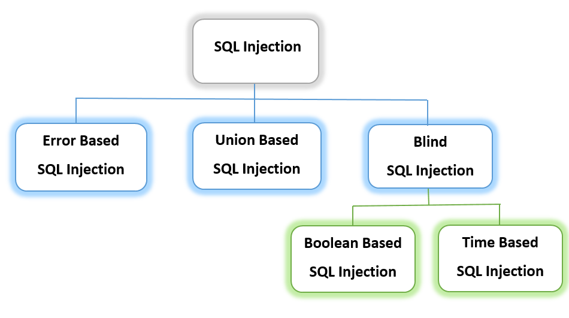

# Web Security

Web security is the practice of protecting websites and online services from unauthorized access, use, modification, or destruction. It is an essential aspect of internet safety, and involves a range of techniques and technologies, including firewalls, encryption, secure coding practices, and regular security audits. With the increasing prevalence of online threats such as hacking, phishing, and malware, web security has become more important than ever before.

### You need to open chrome  developer tools in every url test

## References

- https://github.com/infoslack/awesome-web-hacking
- [https://trailofbits.github.io/ctf/web/exploits.html](https://trailofbits.github.io/ctf/web/exploits.html)
- [https://resources.infosecinstitute.com/n00bz-ctf-challenge-2-practical-website-hacking](https://resources.infosecinstitute.com/n00bz-ctf-challenge-2-practical-website-hacking)
- [https://www.pentesterlab.com/exercises/web_for_pentester/course](https://www.pentesterlab.com/exercises/web_for_pentester/course)

## SQL Injection

- Types of sql injection



- SQL injection လုပ်လို့ရလား စမ်းချင်ရင် url (or) parameter ရဲ့နောက်မှာ single quotes (or) double quotes လေးနဲ့စမ်းကြည့်နိုင်သည်။`?id=1'`

### SQL Comments

`?id=1’ — -`

`-- Comments`

### SQL Commands

- `SELECT * FROM USERS WHERE id = '3' order by 3 --`
- `SELECT * FROM USERS WHERE id = '3' and false union select 1, 2, 3` and false လုပ်လိုက်မယ်ဆိုရင် ရှေ့က id = ‘3’ ကို အလုပ်မလုပ်တော့ပါဘူး နောက်က `union` ကနေစ အလုပ်လုပ်ပါတယ်။
- နောက်ပြီး အဲ့ဒီ select နောက်မှာ sql function တွေကိုထည့်သုံးလို့ရပါမယ်။ eg- `version(), database(), user()`
`SELECT * FROM users WHERE id = ‘3’ and false union select 1, version() , 3`

## SQL Injection

- `OR 1=1 ---`
- `admin ' --`
    - [https://www.acunetix.com/blog/articles/exploiting-sql-injection-example/](https://www.acunetix.com/blog/articles/exploiting-sql-injection-example/)


## Window server vs linux server

- ttl 100 အောက်ဆို linux server
- ttl 100 အထက်ဆို window server

## Commands in URL

- URL ရဲ့နောက်မှာ သို့မဟုတ် textfield တွေထဲမှာ linux command ကို ရိုက်ထည့်ခြင်းအားဖြင့် flag နဲ့သက်ဆိုင်တာတွေတွေ့နိုင်ပါတယ်။ 
ဒီလိုမျိုး OS ထဲက file တွေကို Direct Execute လုပ်ထားတဲ့ Source Code တွေကို တွေ့ရင်လည်း Linux Command  တွေ (သို့မဟုတ်) Windows Commands တွေကို အသုံးပြုလို့ရပါတယ်။

```jsx
exec(`/usr/games/cowsay ${req.params.message}`, {timeout: 5000}, (error, stdout) => {
    if (error) return res.status(500).end();
    res.type('txt').send(stdout).end();
  });
```

# Add Cookie in Http request

### Sending Cookie in Request HeaderTo send cookies to the server in the request header, you need to add the "Cookie: name=value" HTTP header to the request. To send multiple cookies in one Cookie header, you must separate them with semicolons. Servers store cookies in the client browser by returning "Set-Cookie: name=value" HTTP headers in the response. In this Send Cookies Example, we send cookies to the ReqBin echo URL in the HTTP request header. Click Send to execute Send Cookies Example online and see the results.

**Sending Cookie in Request Header[Send](https://reqbin.com/req/tlotpetw/send-cookies-example#)**

`GET /echo HTTP/1.1
Host: reqbin.com
Cookie: name=value; name2=value2`

## Request POST with `curl`

- `curl -X POST -d 'username=admin' -d 'password=71urlkufpsdnlkadsf' [http://165.227.106.113/post.php](http://165.227.106.113/post.php)`